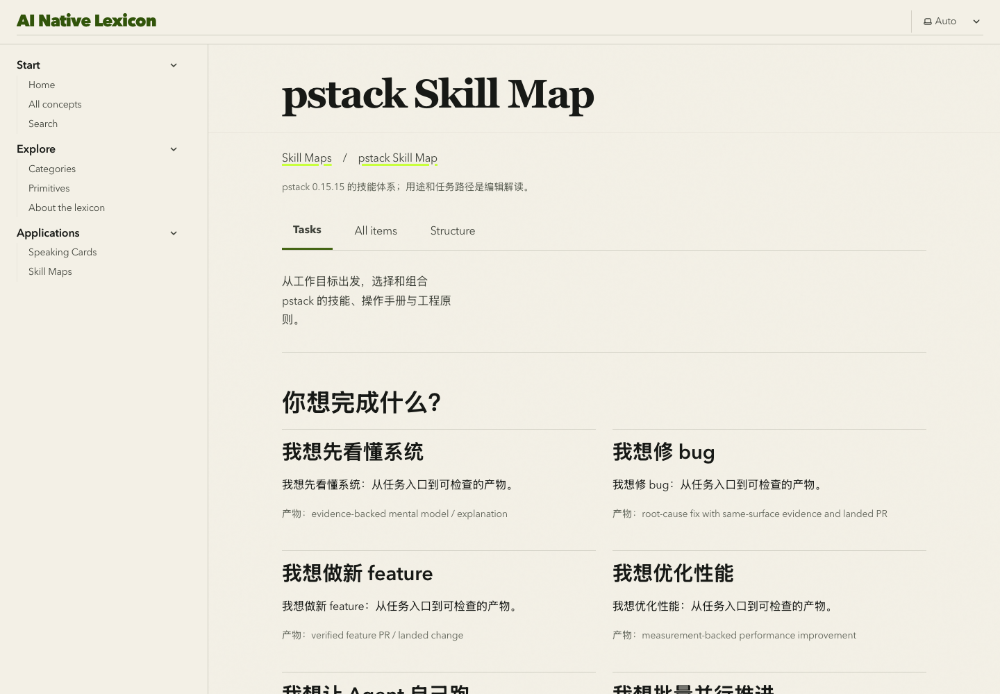

# AI Native Lexicon

> A field guide to the language of systems that can reason and act.

[**Explore the live lexicon ↗**](https://hilt21.github.io/ai-native-lexicon/) · [Browse the source](https://github.com/hilt21/ai-native-lexicon) · [Open the dataset](https://hilt21.github.io/ai-native-lexicon/dataset.json)

AI-native software brings together context, tools, permissions, memory, state, and feedback. This open lexicon helps developers, system designers and educators understand those ideas, discuss design decisions, prepare explanations and explore how agent skills work together.

**84 concepts · 18 categories · 42 primitives · 20 Speaking Cards · 2 Skill Maps**

## Start with your task

| I want to… | Start here | What I get |
| --- | --- | --- |
| Understand a term | [Concepts](https://hilt21.github.io/ai-native-lexicon/concepts/) | Working definitions, boundaries, use cases and anti-patterns. |
| Discuss a system design | [Primitives](https://hilt21.github.io/ai-native-lexicon/primitives/) | Reusable design elements, composition examples, trade-offs, ownership and priority. |
| Prepare a talk or discussion | [Speaking Cards](https://hilt21.github.io/ai-native-lexicon/speaking-card/) | Core ideas, key lines, cases and discussion prompts. |
| Choose and combine agent skills | [Skill Maps](https://hilt21.github.io/ai-native-lexicon/skill-maps/) | Task journeys, skill descriptions, relationships and pinned source evidence. |

Browse concepts by [category](https://hilt21.github.io/ai-native-lexicon/categories/), or use [search](https://hilt21.github.io/ai-native-lexicon/search/) to find concepts, primitives, Speaking Guides, maps, map nodes and task journeys.

## Try two reading paths

**From an idea to a discussion:** start with [Harness](https://hilt21.github.io/ai-native-lexicon/concepts/harness/), open the [Harness primitive](https://hilt21.github.io/ai-native-lexicon/primitives/harness/), then use [Agent Harness · Card 04](https://hilt21.github.io/ai-native-lexicon/speaking-card/#card-04) to explain and discuss the design.

**From a task to a skill combination:** open the [pstack Skill Map](https://hilt21.github.io/ai-native-lexicon/skill-maps/pstack/), choose [“我想修 bug”](https://hilt21.github.io/ai-native-lexicon/skill-maps/pstack/journeys/fix-bug/), and follow the recommended and conditional steps to each node's mechanism, inputs, outputs and source. The first map contains 74 nodes covering skills, playbooks and principles, with seven task journeys. These journeys provide guidance; the website does not execute skills.

The [Matt Pocock Skills Map](https://hilt21.github.io/ai-native-lexicon/skill-maps/mattpocock/) offers seven task journeys and 31 skills pinned to upstream 1.3.1. Its scope includes the 27 plugin-listed skills and four repository misc tools; seven in-progress skills are excluded. Start with [choosing a skill](https://hilt21.github.io/ai-native-lexicon/skill-maps/mattpocock/journeys/choose-a-skill/) or [building a feature](https://hilt21.github.io/ai-native-lexicon/skill-maps/mattpocock/journeys/build-a-feature/). Recommendations explain when the user chooses an entry and when a workflow uses a reusable capability.



## Data and editorial boundaries

Entries are editorial working definitions, not claims of universal agreement. Concepts show maturity; primitive entries identify their synthesis basis and whether sources have been independently verified. Relationship and schema checks keep references inspectable as the collection grows.

Concepts and Primitives are knowledge records. Speaking Guides and Skill Maps are independently curated Application Resources; Speaking Cards and Skill Map pages are their current projections. A definition stays with its Concept; a Primitive may reference it or define a distinct meaning; a Speaking Card links to both without copying either. Skill Map references to Concepts, Primitives and Speaking Guides remain a future contract and are not yet implemented.

Canonical YAML lives in:

- `src/data/concepts/` — one record per concept.
- `src/data/primitives/` — one record per primitive.
- `src/data/speaking-cards/` — one record per card, with stable numbers and `#card-XX` anchors.
- `src/data/skill-maps/<map-id>/` — map metadata, independent nodes and journeys, and one relationship table.

The Astro/Starlight static site, search, cross-links and machine-readable exports are projections of these records. Categories and Primitive layers use YAML configuration in `src/data/taxonomy/`; each Skill Map defines its own taxonomy. Valid new maps are discovered automatically without adding page code. Map updates preserve public IDs, pin new source revisions as separate snapshots and retain retired detail pages. Official source descriptions and editorial interpretations are distinguished.

Inspect [`dataset.json`](https://hilt21.github.io/ai-native-lexicon/dataset.json) for separate `concepts`, `primitives`, `speaking_cards` and `skill_maps` arrays, or [`llms.txt`](https://hilt21.github.io/ai-native-lexicon/llms.txt) for compact navigation. See [the export contract](./docs/exports.md) for stable identities, `schema_version`, `dataset_version`, legacy `version` compatibility and build timestamps. The content digest includes taxonomy semantics and excludes deployment/build variables.

Structured YAML expansion is supported. Raw-material ingestion and proposal/approval automation remain planned L3/L4 work.

## Run locally

Requires Node.js 22.12 or newer. The GitHub Actions workflow uses Node.js 24.

```sh
git clone https://github.com/hilt21/ai-native-lexicon.git
cd ai-native-lexicon
npm ci
npm run dev
```

The site opens at `http://localhost:4321/`. Before submitting a change, run the checks used by CI:

```sh
npm run check
npm test
npm run test:extension
npm run test:l2
npm run build
```

`npm run check` detects portable-schema drift, checks the Astro project and validates catalog references and Skill Map sources. `npm test` runs data-integrity and UI-regression tests. `test:extension` checks isolated expansion regressions, including Skill Maps; `test:l2` verifies a complete Concept/Primitive/Speaking Guide expansion under the production base while preserving routes and anchors. `npm run build` validates the catalog and builds the static site.

After changing field rules or category/layer configuration, run `npm run schema:generate` before verification. `npm run schema:check` detects drift without writing files.

Optional browser verification: install Chromium with `npx playwright install chromium`, then run `npm run test:l2 -- --browser`. See [the L2 workflow](./CONTRIBUTING.md#repeatable-l2-expansion-acceptance) and [verification evidence](./docs/audits/l2-10-verification.md).

## GitHub Pages

The [Pages workflow](./.github/workflows/pages.yml) validates, tests, builds, and deploys the site on successful pushes to `main` or `master`; pull requests run the checks without deploying. The deployment derives its URL and repository subpath from the GitHub environment.

## Guides and contracts

Help improve a term's boundary, example or evidence, or propose a meaningful new record. Use these guides for detailed requirements:

- [Content editing and validation](./CONTRIBUTING.md), including [Speaking Guides](./CONTRIBUTING.md#scope-of-changes) and [Skill Maps](./CONTRIBUTING.md#skill-maps).
- [Primitive content guide](./docs/primitives.md).
- [Brand visual language](./docs/design/brand/visual-language.md) and [website design system](./docs/design/redesign-system.md).
- [Skill Map field and UI contract](./docs/design/skill-map.md), [pstack source-verification record](./docs/audits/skill-map-sm-01.md) and [Matt Pocock source and semantic audit](./docs/audits/skill-map-mp-01.md).
- [Shared content boundary](./src/domain/content/README.md) and [machine-readable projections](./docs/exports.md).
- [Domain glossary](./GLOSSARY.md) and [application-resource architecture](./docs/adr/0006-application-resources-and-projections.md).

Source code: [MIT](./LICENSE). Editorial content: [CC BY 4.0, except where otherwise noted](./LICENSE-CONTENT.md). Upstream-derived Skill Map content retains the source MIT notices for [pstack](./src/data/skill-maps/pstack/SOURCE-LICENSE.txt) and [Matt Pocock](./src/data/skill-maps/mattpocock/SOURCE-LICENSE.txt).
