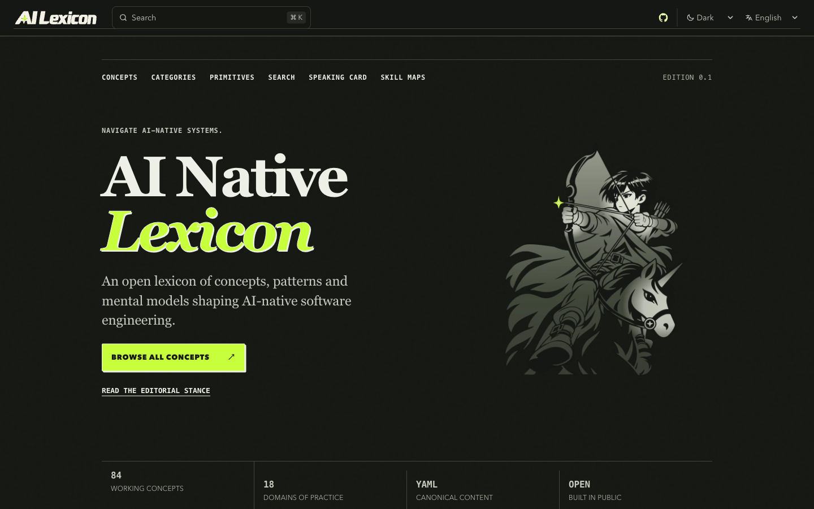

# Dark 首页主视觉：暗部融合最小实验

2026-10-09，分支 `codex/hero-editorial-experiment`。基线为首轮实验 `10727c2`，实现提交 `2d9ba6c`。本轮按用户同意的方向，仅调整 Dark 素材的局部明暗，保持尺寸、位置、Light、文字和 CTA；已本地验证，尚未推送或发布。

## 实际效果与判断

原暖白版的披风、衣装和靴子形成大块亮面。新版把这些区域降至页面已有的深灰，将较亮部分集中在脸、双手和独角兽头，北极星继续使用酸绿。局部渐变仅位于已有路径内部，外围保持透明；无光晕、底板、框架、纹理或新动效。

本次查看 1440 px 桌面、360 px 手机及内置浏览器实图，判断新版与暗色页面的联系更强，人物识别部位仍然清楚。此项是设计判断，尚无用户识别或任务发现研究结果。素材说明与可重复生成脚本见 [v3 交付](../design/brand/hero-artwork/v3/README.md)。

| 视图 | v2 暖白实体 | v3 暗部融合 |
| --- | --- | --- |
| 1440 × 900 首屏 | [改前](hero-dark-blend-experiment/v2-dark-1440.png) | [新版](hero-dark-blend-experiment/v3-dark-1440.png) |
| 360 × 800 首屏 | [改前](hero-dark-blend-experiment/v2-dark-360.png) | [新版](hero-dark-blend-experiment/v3-dark-360.png) |
| 360 px 完整主视觉区域 | [改前](hero-dark-blend-experiment/v2-dark-360-hero.png) | [新版](hero-dark-blend-experiment/v3-dark-360-hero.png) |

上述对照在同一个当前页面与相同视口中，仅切换 v2/v3 Dark 背景素材，等待真实图片解码后截图；它不是第二套网页实现。用户已有的内置浏览器预览已刷新至新版并切为 Dark，实际显示见 [浏览器截图](hero-dark-blend-experiment/in-app-dark-artwork.png)。

## 验证结果

| 检查 | 结果 |
| --- | --- |
| `npm run check` | 0 errors、0 warnings、0 hints；schema/catalog 验证通过 |
| `npm test` | 91 通过、0 失败；需要本机权限启动现有分享图测试的 Chromium |
| 生产 `npm run build` | 575 Astro 页面，Pagefind 开启，默认及卡片分享图生成成功 |
| `npm run test:browser -- --reuse-build` | 302 通过、0 失败，生产 `/ai-native-lexicon`、full Chromium；现有焦点、主题和 BFCache/reload 断言通过 |
| 独立响应式检查 | 英文/中文 × Light/Dark × 9 视口，共 36 组合通过；每组人物、文字、CTA 及文档宽度与首轮记录完全一致 |
| 主题与 DPR | 只下载当前主题资产；DPR 2 的 Auto 切换从 v2 Light 680 px 请求转至 v3 Dark 680 px，图片可解码 |
| 素材轮廓 | 240/330/340/680 px 下，v2/v3 的实际渲染 alpha 摘要完全相同；Light 文件未修改 |
| Standards / Spec 审查 | 两轴均无未解决发现；独立隔离重建的 SVG、WebP 和素材索引与提交逐字节一致 |

几何与网络证据见 [布局记录](hero-dark-blend-experiment/layout-report.json)，验证环境及精确指标见 [摘要](hero-dark-blend-experiment/verification-summary.json)。完整运行日志保存在本地 `work/hero-blend/`，浏览器清单为 `work/hero-blend/browser/manifest.json`。

| 桌面实验室指标 | v2 | v3 |
| --- | --- | --- |
| Lighthouse 性能 / 无障碍 | 100 / 100 | 100 / 100 |
| LCP | 525 ms | 523 ms |
| CLS | 0 | 0 |
| TBT | 0 ms | 0 ms |

两次测量使用同一电脑、Node 24.19.0、full Chromium、Lighthouse 13.5.0、相同 Python 静态服务与桌面预设；每版测量一次，时间不同。结果未见明显性能退化，不能据此宣称性能提升或真实用户 INP 达标。400% 浏览器缩放与屏幕阅读器会话仍未测量。

## 查看与复验

当前本地预览为 `http://127.0.0.1:8090/ai-native-lexicon/`；选择 Dark 可查看新版，Light 保持首轮素材。当前预览进程停止后，可按 [首轮实验的生产配置](hero-editorial-experiment.md#查看与复验) 重建并启动。

使用 [v3 生成脚本](../design/brand/hero-artwork/v3/build.mjs) 可重建素材及四尺寸轮廓检查；网页验证仍使用项目原有脚本。原 v2 Dark 文件保留作对照，不覆盖原稿或首轮验收证据。
