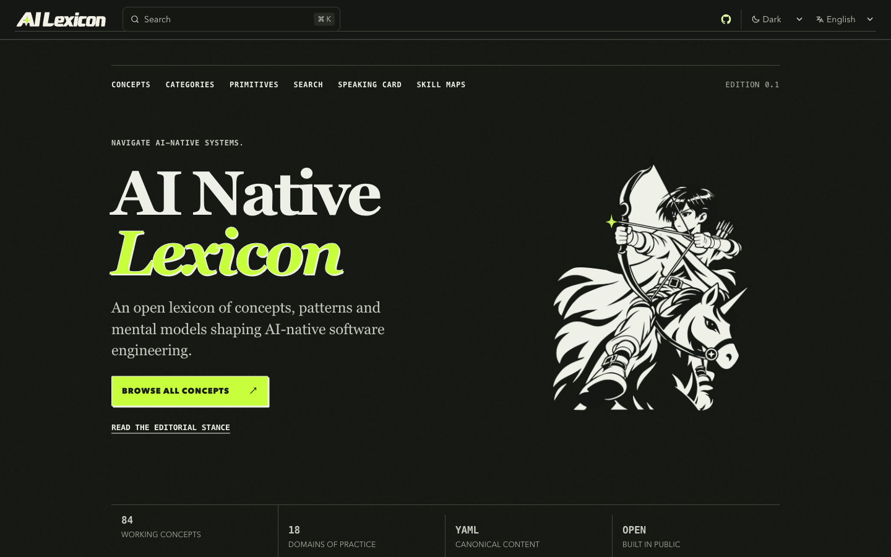
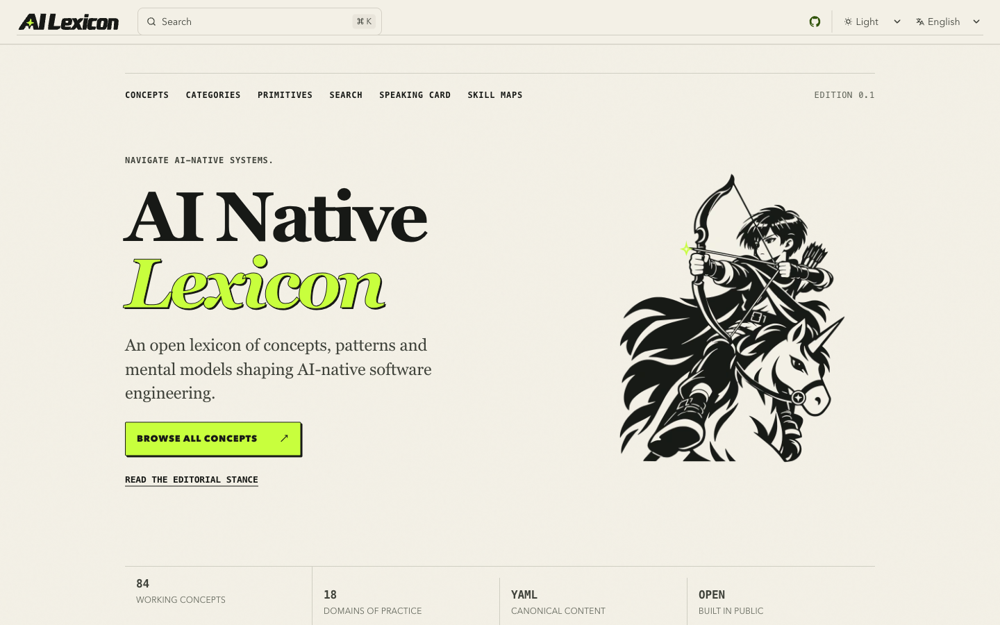

# 首页编辑式主视觉：最小设计实验

2026-10-09。本地分支 `codex/hero-editorial-experiment`，源码基线 `e5f3cda`，实现提交 `64fab4f`。已完成本地实验和工程验证，尚未推送或发布。范围依据 [方案 A](../design/brand/homepage-hero-artwork-plan.md)：调整尺度与位置、重制 Dark 体块、加入北极星箭尖；移动端保持文字和 CTA 优先。

## 结果与取舍

在 1440 × 900、DPR 1 下，角色宽度由 245 增至 330 CSS px（约 +34.7%），视觉中心左移 82.5 px、上移 20 px。文字和角色间隔仍为 48 px，主要 CTA 的位置与改前相同。完整的弓、少年、披风和独角兽位于首屏，未裁切或压迫标题。

Light 保留墨黑实体；Dark 使用暖白衣装、披风和靴子的独立资产，面部与独角兽保持正常明暗。两主题使用共同的矢量外轮廓，箭尖复用酸绿 `#C8FF3D` 北极星。生成、描摹、溯源和尺寸边界见 [v2 素材交付](../design/brand/hero-artwork/v2/README.md)。

360 × 800 手机先展示说明及完整主 CTA，再显示居中的完整角色。主视觉随断点缩至 220–240 px。当前实验构图已独立成立，P2 辅助图形及 P3 微交互留待后续判断。

## 实际页面

| 主题 | 改前 · 1440 × 900 | 实验 · 1440 × 900 | 手机首屏 · 360 × 800 | 手机完整主视觉区域 |
| --- | --- | --- | --- | --- |
| Light | [截图](hero-editorial-experiment/baseline-light-1440.png) | [截图](hero-editorial-experiment/home-en-light-1440.png) | [截图](hero-editorial-experiment/home-en-light-360.png) | [截图](hero-editorial-experiment/mobile-hero-light.png) |
| Dark | [截图](hero-editorial-experiment/baseline-dark-1440.png) | [截图](hero-editorial-experiment/home-en-dark-1440.png) | [截图](hero-editorial-experiment/home-en-dark-360.png) | [截图](hero-editorial-experiment/mobile-hero-dark.png) |

## 验证

| 检查 | 实际结果 |
| --- | --- |
| `npm run check` | 0 errors、0 warnings、0 hints；schema/catalog 通过 |
| `npm test` | 91 通过、0 失败 |
| 生产配置 `npm run build` | 575 Astro 页面；Pagefind 开启；分享图片成功生成 |
| `npm run test:browser -- --reuse-build` | 302 通过、0 失败；生产 `/ai-native-lexicon`，full Chromium，严格 BFCache/reload 断言保留 |
| 独立首屏几何检查 | 两语言 × 两主题 × 9 视口，共 36 组合，无横向溢出；双栏不重叠；指定桌面及 360/390 手机 CTA 完整可见 |
| 主题与 DPR | 初次加载只下载当前主题素材；DPR 2 下载 680 px WebP；Auto 随系统从 Light 切至 Dark，正确请求对应 680 px 资产 |
| Standards / Spec 审查 | 实现无未解决问题；已补齐基线对照，已修正素材索引和交付说明中的旧接入状态 |

几何检查的 9 个视口宽度为 1440、1920、1280、1024、800、768、390、360、320 px。原始页面几何及 Auto 网络结果见 [布局记录](hero-editorial-experiment/layout-report.json)，同条件改前/改后坐标见 [构图对照](hero-editorial-experiment/geometry-comparison.json)。完整浏览器清单位于本地 `work/hero-experiment/browser/manifest.json`；运行日志位于同目录上级。

性能对照使用同一电脑、Node 24.19.0、full Chromium、Lighthouse 13.5.0、相同 Python 静态服务及桌面预设（1350 × 940、DPR 1、模拟限速）；每版测量一次。

| 指标 | 改前 | 实验版 |
| --- | --- | --- |
| 性能 / 无障碍评分 | 100 / 100 | 100 / 100 |
| LCP | 526 ms | 525 ms |
| CLS | 0 | 0 |
| TBT | 0 ms | 0 ms |

环境、配置、精确数值与原始日志路径见 [验证摘要](hero-editorial-experiment/verification-summary.json)。两版实验室结果接近，未见明显性能退化；单次分数不证明速度提升或真实用户 INP。400% 浏览器缩放及真实屏幕阅读器会话尚未测量；320 px 回流检查不替代这些检查。本轮没有上线后的角色识别、任务发现或转化效果证据。

## 查看与复验

运行现有生产配置构建后，以同一环境启动 `npm run preview -- --host 127.0.0.1 --port 8090`，打开 `/ai-native-lexicon/`，通过原生主题控件查看 Light、Dark 和 Auto。当前运行的预览地址为 `http://127.0.0.1:8090/ai-native-lexicon/`。

需要复验时，使用项目已有脚本；本轮生产构建环境为 `GITHUB_ACTIONS=true GITHUB_REPOSITORY=hilt21/ai-native-lexicon GITHUB_REPOSITORY_OWNER=hilt21 BASE_PATH=/ai-native-lexicon`，浏览器输出目录通过 `WEB_EVIDENCE=work/hero-experiment/browser` 指定。复验结果以新输出为准。
