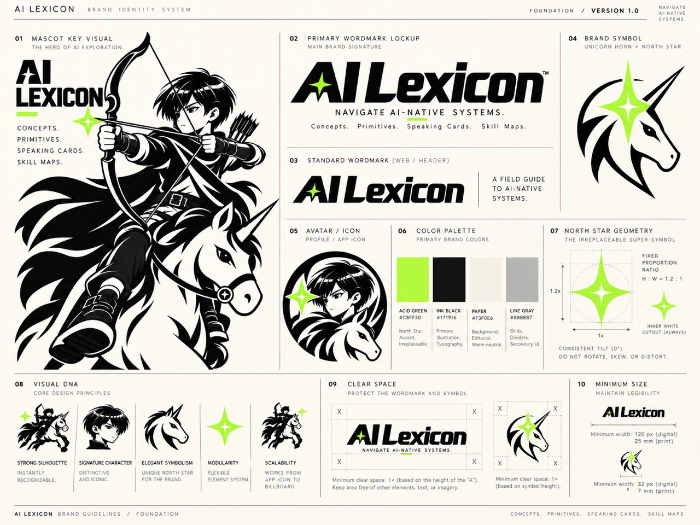
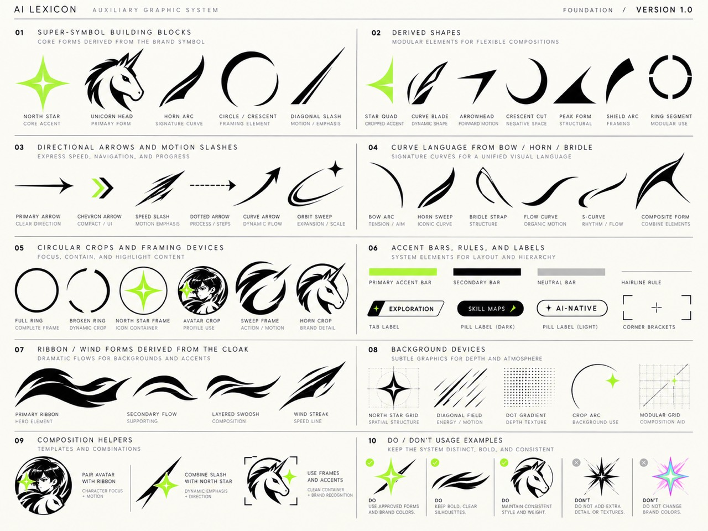
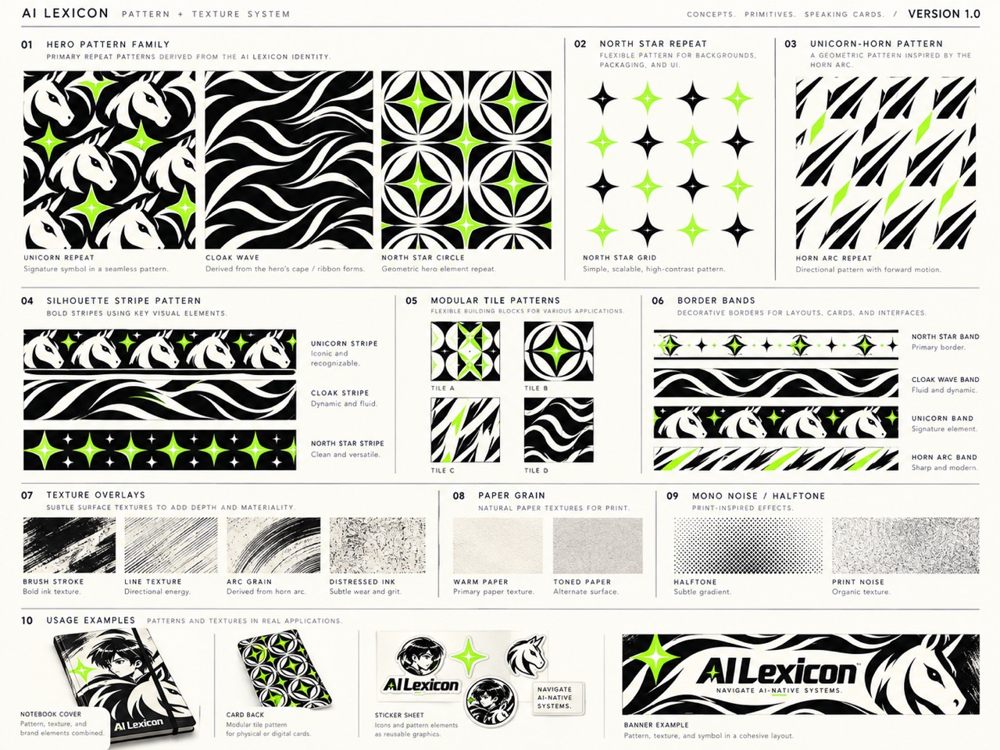
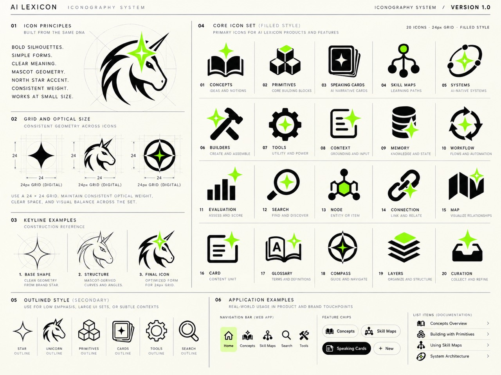
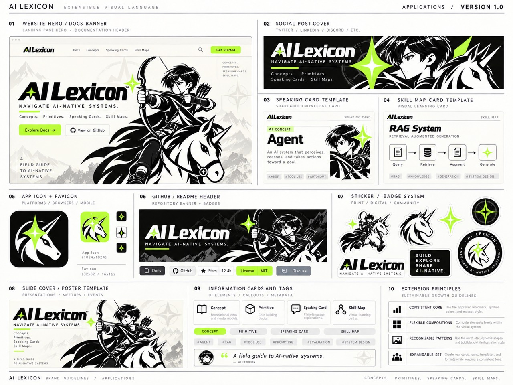

# AI Lexicon 品牌视觉语言

本目录保存项目所有者于 2026-10-09 提供的全套品牌视觉规范，图版标注版本为 **1.0**。五张 JPG 原样归档于 `v1/`，仅重命名以便检索；未裁切、压缩或重绘。

设计与开发从 [品牌视觉语言规范](visual-language.md) 开始，按任务分支查阅下列原稿。本文只维护附件索引与预览；可执行规则、素材交付和验证边界由规范统一维护。

网站 P0/P1 升级的取舍、实施范围与验收见 [BRAND-01 · Spec #44](https://github.com/hilt21/ai-native-lexicon/issues/44)。当前实现行为以 [设计系统](../redesign-system.md) 为准，本地交付证据及实际首屏截图见 [升级验收记录](../../audits/brand-01-verification.md)。

素材提取范围与开发依赖见 [网站素材计划与拆票方案](website-assets.md)。

生产素材及质量边界见 [网站品牌素材交付](asset-delivery.md)。

首页主视觉、手机页头和版本号位置开发前先读 [方案 A：已验收实施规范](homepage-hero-artwork-plan.md)。2026-10-10 用户已验收本地最小实验；当前采用 Light v2、Dark v3、左对齐满列宽手机人物、单行页头控件和底部版本号。实验当时尚未发布；后续正式交付与验证状态见 [交付记录](../../audits/hero-editorial-release.md)。实际页面、源码基线及历史对照统一见 [验收记录](../../audits/hero-editorial-acceptance.md)。素材制作细节由 [v2](hero-artwork/v2/README.md)、[v3](hero-artwork/v3/README.md) 和 [手机导出](hero-artwork/mobile/README.md) 各自维护。

## 图版索引

| 原始附件 | 归档图版 | 内容 |
| --- | --- | --- |
| 照片 1.jpg | [01 · Brand identity](v1/01-brand-identity.jpg) | 吉祥物主视觉、字标、独角兽符号、头像、色板、北极星几何、留白与最小尺寸 |
| 照片 2.jpg | [02 · Auxiliary graphics](v1/02-auxiliary-graphics.jpg) | 辅助图形、箭头、曲线、框架、标签、披风飘带、背景与组合规则 |
| 照片 3.jpg | [03 · Patterns and textures](v1/03-patterns-and-textures.jpg) | 重复纹样、模块拼贴、边带、纸张颗粒、网点与印刷纹理 |
| 照片 4.jpg | [04 · Iconography](v1/04-iconography.jpg) | 24 × 24 图标网格、20 个实心图标、线框变体与应用示例 |
| 照片 5.jpg | [05 · Applications](v1/05-applications.jpg) | 网站首屏、社交封面、知识卡片、Skill Map 卡片、应用图标、README 横幅、贴纸与海报 |

## 预览

### 01 · 品牌基础

### 02 · 辅助图形

### 03 · 纹样与纹理

### 04 · 图标系统

### 05 · 应用延展

