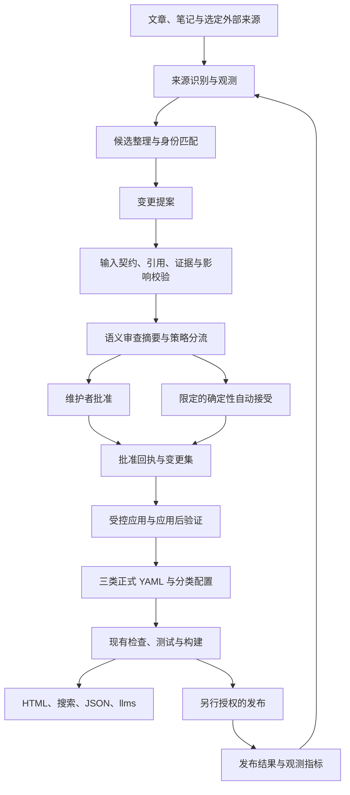

# AI Native Lexicon：系统框架与 L2、L3、L4 开发计划

状态：十三项需求决策已确认，L2 计划已拆为 GitHub Issues #7–#16。L2-01、L2-02 已合并；L2 其余切片、L3 和 L4 尚待实施。当前进度见 [L2 ticket 索引](../../.scratch/l2-data-driven-expansion/README.md)。

日期：2026-10-06。本文中的能力分级是本项目的规划语言，不是外部行业标准。

## 1. 目标与阶段判据

本系统由个人维护，先服务 AI Native Lexicon 的三类内容，再根据第二个真实使用场景评估提炼通用内核。终极目标是持续将材料和外部变化转换为可审查、可追溯的正式知识；网站是其中一个投影。

这里的三类指当前已有数据契约，不是终极系统只能拥有三种内容的封闭枚举。维护者已确认未来 Skill Map 包含独立策划内容，与演讲指南同属应用资源；新增具体类型仍需明确数据契约后另行实施。

| 阶段 | 核心能力 | 阶段完成判据 |
| --- | --- | --- |
| L1.5：当前 | 结构化记录自动展示，部分关联与投影自动派生 | 当前仍有扩充阻塞、投影不对称和契约差异 |
| L2 | 记录及分类、层级配置驱动展示 | 合法新增数据自动更新约定的页面、关系、搜索、导出和发布检查；不改页面代码 |
| L3 | Agent 通过受控接口提出变更 | 材料到三类内容的提案可验证、可审查、可追溯；未经批准或批准已失效的变更不能通过 apply |
| L4 | 持续观测和知识变更治理闭环 | 一个真实来源的变化能够被持续发现、识别、分流、审查、应用并追踪发布结果；重复观测不重复制造变更 |

L4 不要求立即自动接受新的知识观点。自动观测、生成提案、接受变更、发布是四种分别授权的动作。

### 已确认内容模型：领域类别与展示形式

维护者补充：Speaking Cards 展示页帮助用户演讲某个 topic；未来 Skill Map 展示页帮助用户理解和使用 skills，例如一份 YAML 格式的 pstack Skill Map。希望将这些面向使用场景的内容归于一个共同领域模型。

已确认的区别：展示页属于内容投影。当前 Speaking Card 数据本身拥有 keyLines、realCase、discussionQuestion 等独立编辑内容，不能仅因页面使用卡片布局，就把这些内容视为可以从 Concept、Primitive 自动推导的格式配置。

上位模型为 **应用资源（Application Resource）**：围绕一个主题和使用目标独立策划的内容，帮助使用者完成讲解、学习、选择或实践任务。演讲指南与技能地图是该类别下的具体类型；其领域身份由内容目的决定，页面布局属于内容投影。

| 层次 | 示例 | 区分依据 |
| --- | --- | --- |
| 知识条目 | Concept、Primitive | 定义与基本构成单元 |
| 应用资源 | 现有演讲指南内容、未来 Skill Map 内容 | 围绕使用目标独立策划的内容与关系 |
| 具体数据契约 | Speaking Card schema、未来 Skill Map schema | 各自内容结构和不变量 |
| 内容投影 | Speaking Cards 页面、Skill Map 页面 | 面向阅读与使用的表现形式 |

同一份资源可以呈现为卡片、列表或地图；更换投影不创建新的领域记录。同一主题的演讲指南与技能导航若具有不同目的和独立策划内容，应是不同应用资源，可以引用相同的 Concept 和 Primitive。

维护者已确认 pstack Skill Map YAML 将承载独立维护的技能用途、选择路径、组合关系或实践建议，因此属于应用资源。仅规定布局、筛选或排序的数据仍属于投影配置；尚未检查实际 pstack Skill Map 数据，具体字段待样本确认，也不假设 Skills 已是仓库中的独立知识实体。

应用资源在领域上共有主题、使用目标、内容身份和知识关联等含义，各类型的具体字段由各自契约表达。主题不强制等同于某一个 Concept，也不要求每份资源同时具有关联概念和原语；演讲指南的讲解顺序与 Skill Map 的技能选择、组合关系具有不同不变量，应分别校验。

对开发计划的影响：L2/L3 先覆盖现有三个契约，但共享模块不应把 Speaking Card 当作应用类内容的永久上限；未来新增已确认的 Skill Map 契约时，再接入读取、验证、提案和投影。领域上的共同类别不要求立即引入通用 kind/payload 容器、继承框架或合并数据目录；现有卡片编号、锚点、YAML 内容保持稳定。

新增记录或分类配置仍可仅通过 YAML 扩充；新增具体资源类型则需要实现其 schema、引用规则及投影，并接入已存在的治理流程，不能声称任意形状的 YAML 自动获得完整支持。本轮确认领域模型，不增加 Skill Map 页面、不迁移 Speaking Card 文件，也不将共同类别作为数据库或插件系统的理由。

## 2. 规划时的代码基线与实际缺口

本节保留规划时的历史快照：当时本地为 `codex/speaking-cards-yaml@2368945b1d757585e26c1bbdd9d8c888c6865e69`，附件 handoff 检查的是 `master@85df1bc`，本地缓存 `origin/master` 为 `c1bd5b3`，设计阶段尚未刷新远端。实际开发前已核实目标分支；L2-01、L2-02 合并后的基线为 `master@446dc95`。

下表的数量冻结和编辑分支问题已由 L2-01 解决；L2-02 新增了输入契约和读取边界，生产调用方仍待后续按类型迁移。其余缺口继续按开发票实施，不能将准备边界等同于 L2 整体完成。

本轮事实检查没有重跑完整应用测试。此前的新增 YAML 实验见 [验证报告](../audits/yaml-addition-architecture-validation-2026-10-05.md)：三类各增一条时检查、构建通过，测试 22/24，两项固定数量断言失败；单独新增卡片时测试 24/24。

| 已核实事实 | 位置 | 规划影响 |
| --- | --- | --- |
| 三集合自动发现，详情页与回链派生 | `src/content.config.ts`、`src/lib/catalog.ts`、`src/lib/speaking-cards.ts`、详情页 | 保留既有数据与模板，不重写网站 |
| 测试固定 84 个概念、42 个原语 | `tests/primitives.test.mjs:14,27` | L2 首先解除发布阻塞 |
| 自定义搜索、dataset、llms 不直接收录卡片 | `src/pages/search.astro`、`dataset.json.ts`、`llms.txt.ts` | L2 补齐三类直接投影；生产 Pagefind 已能索引卡片所在页面 |
| 分类规则重复，runtime 与 portable schema 存在差异 | `src/content.config.ts`、`schemas/`、`scripts/concept-validation.mjs` | 先统一输入契约；不能直接把当前检查器视作完整写入边界 |
| 内容集合递归扫描，部分验证器只扫描顶层 | 集合 loaders、`scripts/concept-validation.mjs` | L2 明确并统一发现范围 |
| 分类全部非空的校验阻止先添加配置 | `scripts/concept-validation.mjs:63-66` | 允许已配置的空分类及层级，保留稳定地址并显示零条目 |
| 首页、分类页类别数量写死，层级锚点由名称派生 | 首页、分类页、`src/lib/primitive-presentation.ts` | 计数来自注册表；现有 URL、锚点迁移为显式值 |
| 编辑链接有两处 `/edit/main/` | `astro.config.mjs`、概念详情页 | 按核实后的内容分支统一配置 |
| 尚无治理对象与写入链 | `src/lib/`、`scripts/`、`schemas/` | L3/L4 新增独立责任，不把现有词典条目当治理对象 |

## 3. 已确认的需求决策

1. 服务本词库，保留三类内容的职责；有第二个真实场景后再评估通用化。
2. 正式知识表示编辑接受；证据核验、成熟度和争议分别表达。
3. L3 全部人工审查；L4 按测量结果逐步开放限定的自动接受。
4. 个人维护，不按多人平台设计。
5. L2 同时支持记录及分类、原语层级的结构化配置扩充；分类变更仍需编辑审查。
6. L3 完成时覆盖三类内容的新增、字段更新和关系调整；相互依赖记录可组成一个提案。首个切片贯通 Concept。
7. L3 先接收主动提交的文章、笔记；L4 再持续观测外部来源。
8. 在 Codex 中审阅前后变化、原因、证据和影响，明确确认后生成受控变更；PR 可用于后续发布及留档。
9. 原始材料默认本地保留；只有确认可公开的来源、证据摘要和批准记录进入公开仓库。
10. 来源、可定位证据与逐项语义变更关联；区分来源陈述、编辑综合和讲解示例，不要求逐句 Claim 对象。
11. 初期每日观测、每周集中审查，支持手动触发；先测真实工作量，再决定是否加频。
12. 自动接受初期仅限可确定验证、含义不变的格式规范化和机械修正；新增知识、定义、关系、分类变化仍人工审查。
13. 将面向任务的独立策划内容归为应用资源，现有演讲指南与未来 Skill Map 是具体类型；各自保留内容契约，展示形式归为投影。

相关领域语言见 [GLOSSARY.md](../../GLOSSARY.md)，已确认架构决定见 `docs/adr/0001` 至 `0006`。

## 4. 系统框架



网页读取正式记录；待审提案不进入内容集合和公开搜索。正式内容、分类配置、治理记录各自只有一个负责当前状态的来源；治理记录保留历史与批准依据，不作为另一份当前词条索引。

### 模块责任与接口建议

| 模块 | 输入 → 输出 | 责任与边界 |
| --- | --- | --- |
| Content contracts | YAML/配置 → 已解析记录或诊断 | 统一字段、分类词汇、标识与跨记录规则；不依赖 Astro |
| Material intake | 文件/来源项 → Source、Observation | 识别出处、定位内容、标明公开范围；不修改正式记录 |
| Candidate preparation | 观测、现有词库 → 候选及匹配结果 | Agent 提取、综合、提出解释；结果保持待审 |
| Proposal validation | 提案、词库快照 → ValidationResult | 在候选树上验证完整结果；检查证据和影响，不认证事实真伪 |
| Review and policy | 验证结果、提案 → 摘要及审查路由 | 生成人类可读摘要；策略决定排队、人工审查或限定自动接受 |
| Controlled apply | 批准回执、提案版本、基线 → ChangeSet、候选提交 | 唯一的受控 Agent 写入入口；验证前置条件、共同应用、恢复与幂等 |
| Projections | 正式记录、公开治理摘要 → 展示及导出 | 查询 canonical 数据；不读取本地原始材料或待审内容 |
| Observation runner | 选定来源、游标、预算 → 新观测及运行结果 | L4 调度、去重、重试、积压报告；复用 L3，不另造接受路径 |

建议接口包括 `readCatalog`、`validateCatalog`、`prepareProposal`、`validateProposal`、`renderReview`、`recordApproval`、`planChangeSet`、`applyChangeSet`、`observeSource`。最初提供本地 CLI，不先建设 MCP 服务或网络写入 API。

### 目录建议

```text
src/data/concepts/                  # 保持正式记录位置
src/data/primitives/
src/data/speaking-cards/
src/data/taxonomy/categories/       # L2：分类配置
src/data/taxonomy/layers/           # L2：原语层级配置
src/domain/content/                # L2：共享输入契约、词汇、读取与完整性
src/domain/governance/              # L3：对象、校验、审查与受控应用
scripts/knowledge.mjs               # L3：薄 CLI 入口
scripts/observe-knowledge.mjs       # L4：观测 runner
.knowledge-local/                  # 忽略入 Git；原始材料、待审队列、私有证据、游标
knowledge/sources/                 # 已确认可公开的来源元数据
knowledge/evidence/                # 已确认可公开的证据摘要
knowledge/changesets/              # 已确认可公开的应用与批准历史
schemas/                           # 生成的 portable schemas
src/pages/                         # 保留 Astro 投影
```

这些是模块落位建议，不要求一开始创建全部目录。按阶段建立实际需要的文件；本地目录位置可以覆盖以支持个人备份，不把本地临时副本冒充已提交审计历史。公开治理文件不是第四类词条。

## 5. 对象、状态与关键不变量

### 最小对象契约

| 对象 | 必需表达的内容 |
| --- | --- |
| Source | 稳定来源标识、标题、发布者/作者、类型、可选公开 URL、公开范围、信任说明 |
| Observation | 来源标识、观测时间、内容指纹、来源修订或时间信息、可定位的本地材料引用 |
| Evidence | 来源和观测引用、段落/章节/行号等定位、支持或反驳范围、摘要、核验状态、公开范围 |
| Proposal | 标识和不可混淆的版本、生成者、基线、逐项操作、理由、证据关联、受影响记录 |
| ValidationResult | 对应提案及基线、阻塞错误、非阻塞提示、身份冲突、影响分析、验证器版本 |
| Approval | 批准者、时间、提案版本、审查摘要与内容摘要哈希、基线、批准范围、决定 |
| ChangeSet | 批准依据、确定性变更项、前置条件、结果摘要、应用状态与提交指针 |
| PublicationResult | 对应提交/ChangeSet、构建结果、部署状态和目标；与内容接受分开 |

字段名称和具体 schema 随最小切片定稿；上述语义是验收约束。审查状态使用 `pending/accepted/rejected` 等治理状态，不能复用已有 `foundational/emerging/evolving/contested` 内容成熟度。

### 状态建议

- 提案：`draft → ready_for_review → accepted | rejected`。材料不足或身份冲突进入 `needs_info` / `conflict`，补充并重新验证后才能进入审查。
- 内容、证据、基线或批准范围变化，产生新提案版本；旧版本批准不自动沿用。失效版本标记为 `stale` 或 `superseded`，不静默覆盖批准历史。
- 变更集：`planned → staged → applied_local`；失败可为 `failed`，前置条件变化为 `stale`。已应用的同一变更集再次执行返回既有结果，不重复修改。
- 集成和发布另行记录。`accepted` 不表示已提交，`applied_local` 不表示已合并默认分支，构建成功也不表示已部署。
- 观测：重复来源修订可忽略；内容变化分别产生新观测。失败抓取不推进成功游标，未转成提案的观测也保留处理理由。

### 写入与审查边界

1. 提案使用类型化操作：新增记录、替换明确字段、增加或移除明确关系。模型不能提供任意文件路径、shell 命令或可执行补丁；工具从记录类型和标识推导允许的路径。
2. 校验必须在完整候选树上运行。新 Primitive 的定义引用与 Concept 回链作为同一批次检验，任何一项失败均不得只应用其余项。
3. 批准绑定精确提案版本、变更内容、摘要和基线。apply 前重新比较，记录已变化或证据替换就重新审查；初版允许较严格地因基线变化而失效，后续再优化无关变更的重审。
4. 批准记录来自维护者操作的可信入口，不信任模型自填 `approved: true`。Codex 用于组织与显示审查；v0 不假设存在本仓库可直接调用的 Codex 原生批准 API。
5. L3 首个技术切片须验证批准传递：维护者能针对摘要中的 proposal ID、版本和哈希产生批准回执，提案 Agent 不获得批准入口。没有可验证批准来源时 apply 保持关闭，可先完成提案与审查摘要。
6. v0 推荐在隔离候选树中构造和验证全部变更，通过后形成一个候选 Git 提交及对应审计记录；主工作区未提交内容保持完整。不宣称跨多个文件的普通写入天然具有事务性。
7. 推送、默认分支集成、部署使用独立授权或后续明确配置的发布策略。自动接受格式修正不自动赋予这些权限。
8. 受控入口和 CI 约束不能代替操作系统权限隔离；有本地任意写权限的操作者仍能绕过工具。若要求强制隔离，须将提案执行器限制为只写本地提案区，正式写入交给独立执行器，并实测权限边界。
9. L2/L3 保留已有 Concept/Primitive slug 和卡片 number；分类 URL、层级 anchor 原样迁移。初期使用带类型的记录标识，避免把同名 Concept 与 Primitive 混为同一对象。
10. 来源可访问不等于内容真实；证据可定位不等于已经核验。已有历史记录无需虚构批准回执，标明其治理证据尚未迁移。

## 6. 材料、证据与公开范围

原始文章、笔记、本地路径及未确认的证据默认不提交，也不由 Astro、导出或搜索读取。公开来源元数据、证据摘要和批准历史需经维护者确认可公开；内容接受与允许公开不能互相代替。

一项语义变更需要至少一个可定位依据，并注明属于来源陈述、编辑综合还是讲解示例。编辑综合可以关联多条材料，明确推导限制；原创讲解示例标明编辑性质，不伪造外部来源或事实核验。支持与反驳证据分别保留；已有卡片的空关系仍合法，不为了覆盖率制造关系。

对个人私有笔记，审查包可以引用本地证据；准备进入公开词库时，维护者须确认可公开的摘要及其性质。若既不能公开支持材料，也不能给出可公开的编辑说明，则继续保留为私有候选，不伪装成可公开核验的结论。

材料指纹、证据定位、批准和结果关联保存在治理历史中。未来来源消失时，可以表达证据已不可访问，不能把旧链接再次出现自动视作旧证据仍然有效。

## 7. L2 开发计划：解除阻塞并统一投影

实施顺序为 L2-0 → L2-1 → L2-2 → L2-3 → L2-4。不同时启动 L3 的正式写入开发。

| 切片 | 交付 | 主要文件 | 验收 |
| --- | --- | --- | --- |
| L2-0 基线与扩充阻塞 | 确认内容分支；移除 84/42 数量冻结，保持完整性检查；统一 edit branch 配置 | `tests/primitives.test.mjs`、`astro.config.mjs`、概念详情页 | 三类各新增一条合法 YAML 后全套检查通过；原有链接保留；编辑链接指向确认分支 |
| L2-1 输入契约 | 三类共享 Zod 输入 schema、统一发现器、跨记录校验入口、portable schema 生成及漂移检查 | 新 `src/domain/content/`、现有 schema/验证脚本、`schemas/`、`package.json` | runtime、CLI、portable schemas 对同批合法/非法样本判断一致；未知字段、重复关系、损坏 YAML 及无效引用被拒绝 |
| L2-2 分类配置 | 将既有分类/层级配置迁为独立 YAML；计数和排序派生；允许空组 | 新 taxonomy 目录、catalog、primitive presentation、分类页、首页、CategoryGrid | 只添加配置 YAML 即生成新类别路由/层级 anchor；名称、slug、anchor、顺序规则明确；既有标识不变 |
| L2-3 三类投影 | 将卡片加入直接搜索、dataset 和 llms；版本与标识信息明确 | 三个投影文件、相关 row/list 组件、机器导出测试 | 新卡片可按标题、核心观点与关联查找；三个投影包含三类记录；卡片 URL 带稳定锚点及 base |
| L2-4 扩充回归 | 将此前临时新增实验转成可重跑的集成验证，更新贡献说明 | 集成测试/验证脚本、`CONTRIBUTING.md`、`README.md` | 无页面代码修改的新增实验通过全套检查；受检桌面/移动布局、搜索、展开与回链正常 |

### L2 技术细节与兼容性

- 当前 lockfile 中 Zod 为 4.4.3，本地已有 JSON Schema 导出接口；若将其作为 domain 契约，明确声明直接依赖。
- canonical 输入的日期使用 ISO 日期字符串；需要 JS Date 的位置在边界转换。当前 `z.coerce.date()` 不能直接导出为 JSON Schema，不能用放宽为任意值的办法掩盖该约束。
- 生成 portable schema 不取代跨记录校验。defaults、strict、unique、字符串格式及不可直接导出的细化条件，用成对样本测试和确定性校验覆盖。
- 三类文件初版统一为既有目录的直接子文件，支持 `.yaml` / `.yml`，不为暂未需要的多层目录扩展关系标识。
- 分类配置建议 `{name, slug, code, description, question, order}`，层级建议 `{name, anchor, order}`。保留现有名称引用，避免同时迁移全部内容；display name 重命名后续另行治理。
- 新配置可暂时无成员，页面显示零条目；未知分类仍报错。已有五个 `layer-*` anchor 原样保存，分类 URL 不根据名称重新计算。
- 保留现有 dataset 的 `concepts`、`primitives` 顶层数组，追加 `speaking_cards` 及明确的 `schema_version`、`dataset_version`、counts。dataset version 推荐来自内容、配置及公开证据的稳定摘要，构建时间单独记录；可另附实际 source commit，不把构建时间当内容版本。
- 页面仍按类型使用既有模板；分类数、列表计数与网格编号自动派生。新增内容会自然增加页面高度，不要求像素位置完全不变。

**L2 门槛**：三类新增和分类配置新增均通过 `npm run check`、`npm test`、`npm run build`；机器投影覆盖三类；既有标识和相关行为保持稳定。此后才开始 L3 的受控写入。

## 8. L3 开发计划：个人审核的受控写入

L3 以真实材料到一个新 Concept 的窄切片启动，再拓展全部三类；不先接入持续爬取。

| 切片 | 依赖 | 交付 | 验收 |
| --- | --- | --- | --- |
| L3-1 治理对象与批准边界 | L2 完成 | 最小 Source/Evidence/Proposal/Approval/ChangeSet 契约，版本和状态；验证可信批准传递 | 非法提案、伪造/缺失/失效批准被拒绝；私有记录不进入公开投影；无可信批准来源时 apply 关闭 |
| L3-2 材料与单 Concept 提案 | L3-1 | 本地材料入口，Agent 候选整理，确定性匹配和证据关联 | 一份真实文章或笔记生成一个可审查 Concept 提案；来源陈述与编辑综合可区分；提案期间正式数据无变化 |
| L3-3 语义审查 | L3-2 | prepare、validate、review；前后内容、理由、证据、影响；接受/拒绝/修改 | 维护者无需逐个读 YAML 即可审查；修改产生新版本；拒绝不改正式数据；记录人工审查基线耗时 |
| L3-4 受控应用 | L3-3 | 类型化路径映射、候选树验证、批准哈希核对、候选提交、恢复与幂等 | 新 Concept 完整贯通；重复 apply 不重复写；基线变化阻塞；中途失败不暴露部分正式结果；全套检查通过 |
| L3-5 三类与依赖变更 | L3-4 | 原语及卡片；字段更新；关系调整；跨记录共同校验与应用 | 新 Primitive 与 Concept 回链共同通过或共同失败；新卡片自动产生回链；不可修改稳定 slug/number |
| L3-6 公开审计与个人流程 | L3-5 | 可公开来源/证据/ChangeSet 留档；CLI 使用说明；审查和发布状态查询 | 从正式改动追到具体批准、提案及证据；私有路径/正文未进入 Git 或导出；应用与发布状态可分别检查 |

建议在 `src/domain/governance/` 按实际复杂度增加 schema、validation、review、apply 模块；`scripts/knowledge.mjs` 只组织文件读写和命令，不复制领域规则。初版采用本地文件队列和 Git 历史，无数据库、后台或模型供应商框架。

`prepare`、`review`、`approve`、`apply` 是不同授权动作，approve 不对提案 Agent 暴露；首次宿主整合先验证人工批准的可信性。个人维护允许拒绝、修改并重新准备，不要求引入多人权限系统。未经独立授权，不把局部批准解释为推送、合并或上线。

**L3 门槛**：真实材料能生成三类记录的受控变更；证据、语义摘要、批准和应用历史关联完整；上述失败场景可复现且被阻止；现有投影及发布检查通过。批准通道或写权限边界未验证时，只能交付提案能力，不宣称完整 L3。

## 9. L4 开发计划：从一个来源形成持续闭环

实施 L4 时再选择具体公开来源。先用一个具备稳定标识和修订信号的官方工程来源；来源选择依据是相关性、变化可检测性、可定位证据和可获取内容，而不是直接采纳 handoff 中引用的外部仓库设计。本轮未验证这些外部参考，也未创建调度任务。

| 切片 | 依赖 | 交付 | 验收 |
| --- | --- | --- | --- |
| L4-1 单来源适配器 | L3 完成 | 一个来源的配置、读取、游标、指纹、观测落盘 | 新项、修改、重复、暂时失败、来源不可用都有明确结果；重试不遗漏或重复推进游标 |
| L4-2 相关性与身份分流 | L4-1 | ignore/new/update/relationship/conflict 分类；类型化标识、候选匹配和冲突队列 | 真实样本及人工标注评估集验证分流；疑似同义词不直接创建重复词条；冲突保留理由和候选 |
| L4-3 定期运行与审查队列 | L4-2 | 每日观测、每周审查摘要、手动触发、运行预算、去重和恢复 | 多次运行同一修订只产生一个有效候选；失败或积压可见；无变化无需人工处理；材料变化导致旧提案需重审 |
| L4-4 应用与发布回执 | L4-3 | 复用 L3 的批准/apply；关联现有 CI 的构建及部署结果 | 完成一次真实的观察到经授权发布；发布失败不标记成功，仍可追踪已接受及待发布版本 |
| L4-5 限定自动接受 | L4-4 及影子运行评估 | 先只建议不执行；再开放已批准的确定性机械修正策略 | 解析后语义值相同、标识与关系不变、不丢失约定保留的信息；所有反例被拒绝；真实审查样本无越界，策略有停用及回退方式 |
| L4-6 有证据的扩展 | L4-5 及实际需求 | 分类型评估更多来源、自动接受范围、别名与生命周期；按需提供 MCP | 新范围单独批准并有基线/反例；无证据不扩大范围；生命周期迁移有标识、重定向及回链规则 |

L4-5 必须验证确定性条件，而不是设置一个模型置信度阈值。首批允许范围不包括新增知识、定义更新、关系变化、分类变化、合并或拆分；自动接受策略不得由模型在提案中修改。有限样本的零误接受只是观察结果，不等于保证真实知识正确。

持续观测从本地 runner 开始，未来可由明确配置的调度宿主唤醒同一命令；只有在个人机器的持续可用性不满足实际时效目标时，再评估迁移宿主。发布时间不自动绑定观测时间。

### L4 效果评估

| 指标 | 记录方法与用途 |
| --- | --- |
| 分流准确度 | 人工标注样本上分别统计 ignore/new/update/relationship/conflict 的错误；特别记录冲突被漏掉的情况 |
| 审查耗时 | 比较同类变更人工整理/读 YAML 的基线与语义审查耗时，记录接受和拒绝两类成本 |
| 变化延迟 | 分别记录来源变化到观测、提案、接受、发布的时长；每周审查会影响接受延迟 |
| 误接受及回退 | 按策略/变更类型记录越界、撤回和纠错，判断是否停用或扩大策略 |
| 下游一致性 | 新增/更新后关系、搜索、导出、链接与构建回归；后续有 Agent 真实使用时再测检索和回答效果 |

初期运行目标为每天一次观测、每周一次集中审查。若宿主未运行，下次运行应补处理并标记延迟，不宣称全天候保证。数量、准确率阈值和时间预算在首个来源的真实样本基线上设置，再经维护者确认；不以虚构百分比宣告 L4 成功。

**L4 门槛**：至少一个真实来源完成可重复、可恢复的观测—治理—发布闭环，重复与冲突被正确处理；能够衡量个人审核负担和变化延迟；低风险策略在影子运行与反例测试后才启用。广泛自主接受语义变更不属于首版门槛。

## 10. 验证与实施纪律

每个改变数据、schema、验证、页面、配置或样式的切片运行 `npm run check`、`npm test`、`npm run build`；本轮仅文档修改，不用应用测试证明尚未实施的功能。

- L2 测试以不变量为主，保留现有公共标识兼容性，但不冻结全量集合数量。
- 新增集成验证使用隔离目录和临时样本，不将实验条目提交为正式知识。
- 契约对齐用共享的合法/非法样本验证，不只比较两个 schema 的生成文本。
- L3 增加批准伪造/失效、跨记录部分失败、重试、拒绝、私有材料公开边界的行为测试。
- L4 增加重复观测、来源失败、冲突、调度恢复、发布失败和策略越界的行为测试。
- 首个 Concept 纵向切片完成后再扩展其他类型；实际新问题才促使扩大测试、接口或基础设施。

## 11. 后置能力与不在当前计划中的建设

暂不引入数据库、图数据库、向量库、CMS、实时后端、自定义审查后台、通用网页爬虫、多人权限平台或单独 monorepo。MCP 和语义检索属于稳定契约及真实消费需求之后的投影/接口扩展。

合并、拆分、弃用、替代与标识迁移需要单独的身份及重定向设计；硬删除不作为初始治理操作。稳定 ID 与 slug 分离在真实重命名/合并需求出现时评估，不阻塞首个切片，也不把未来迁移成本隐去。

无承诺的日历工期；按阶段门槛推进。设计阶段只形成计划；后续经维护者确认已发布 L2 开发票并完成前两个切片。本文的未来流程建议不构成创建自动化或执行知识写入的授权。

## 12. 整体确认与下一步

十三项产品决策已确认，L2 实施范围已转为十张开发票。目录、接口、最小对象、状态和技术选择继续作为阶段设计依据；每张票以自身的实施范围和验收条件约束实际交付。

从 **L2-0** 开始，依次完成 L2-1 至 L2-4；L2-01、L2-02 完成后，下一实施范围为 L2-03 的 Concept 契约迁移。批准开发计划与批准实际发布分别表达；对材料公开范围、运行节奏和自动接受的设计确认，不是创建定时任务或自动写入正式知识的授权。
